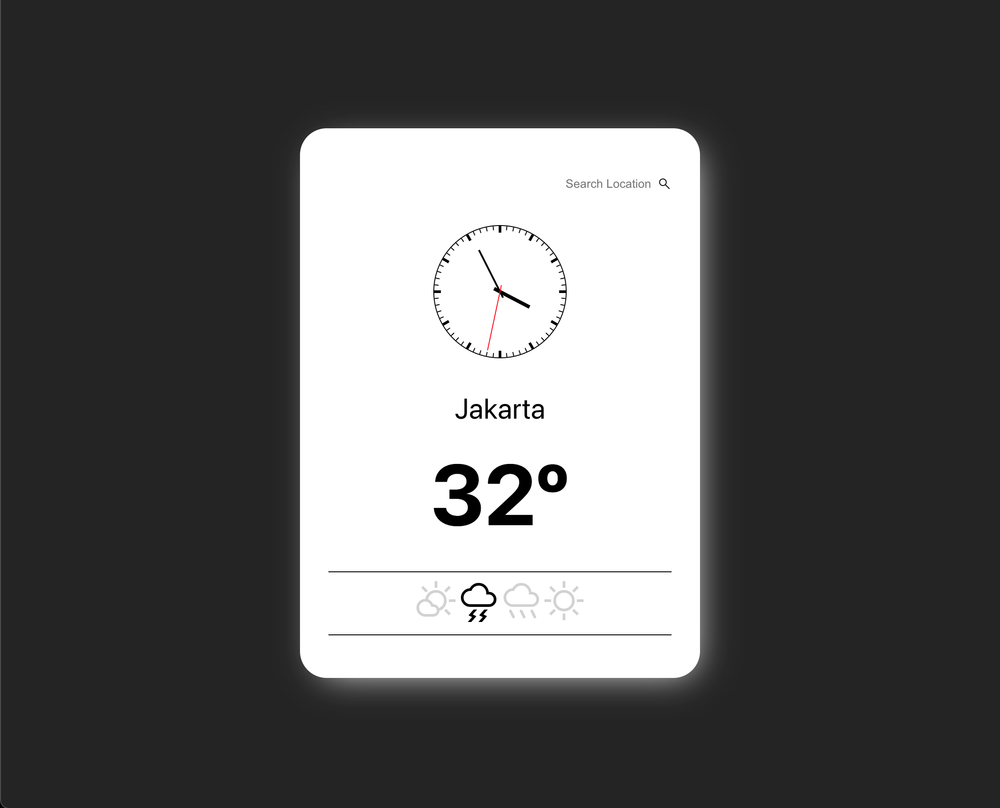

# Live code question 3

1. Given an UI that looks like the following:  

2. Please create a service that can get the weather data from open weather API  
Endpoint:  
> `https://api.openweathermap.org/data/2.5/weather?q={location}&appid={API_KEY}&units=metric` 

Documentation is at:  
> https://openweathermap.org/weather-conditions  

3. Please make it so that the user can input the city name on the input element
4. The **Icons** are _optional_.